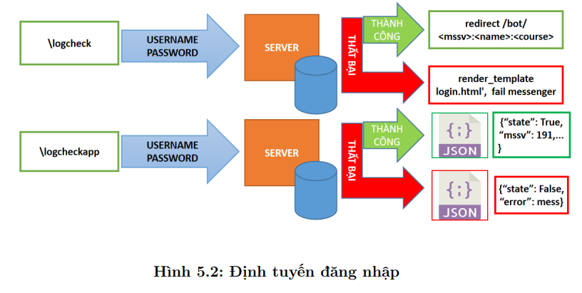

# HCM university of technology's AI Chatbot 
## ABSTRACT 
> Currently, the student regulations are one of the problems that most students still face many difficulties in the process of learning and do not fully understand all the necessary regulations. It leads to the fact that some students misunderstand or do not comply with the regulations, causing delay in graduation as well as in the learning process. 
> Especially, in each course registration, students often encounter difficulties in credit regulations, subject binding, english standards, student standards, and physical standards. So the Academic Office has to solve or advise students about these problems. It leads to overwhelming with staffs of Academic Office. It is difficult and time-consuming for students to find information on the school’s websites. 
> Realizing these limitations, with wishing to create an efficient smart fast information channel, our group decided to choose the topic “ A Chatbot system for student consultant supports”. The main purpose of chatbot is to support regulations and information about department of telecommunications engineering. With applying successful AI applications, methods of building web servers in the model of client server, as well as system integration with raspberry pi and database, the chatbot becomes more flexible, diverse and quicker.

  

  

  

  

  

  

  

  

  

  

